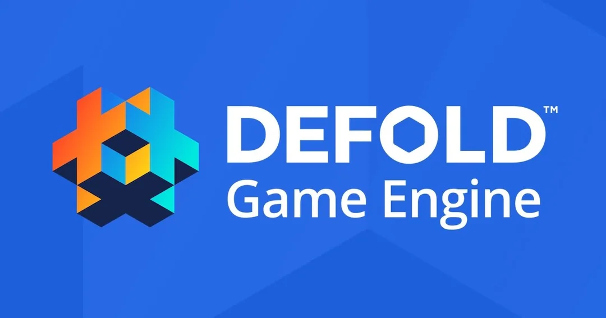

<p align="center">
  
</p>

# Defold AI

[](LICENSE)
[](https://defold.com)
[](https://modelcontextprotocol.io/)

**Connect MCP clients directly to a live Defold editor** via the [Model Context Protocol](https://modelcontextprotocol.io/introduction). Inspired by [godot-ai](https://github.com/hi-godot/godot-ai), adapted to Defold's editor scripts + built-in HTTP server. AI assistants (Claude Code, Codex, Antigravity, etc.) can create collections, spawn game objects, add components, edit scripts, configure render pipelines, ship materials/cameras/particles with preset libraries, and build/run the project — all from natural-language prompts.

> **v0.10.0** is live: `render_manage` DSL, `camera_manage` follow rigs, `material_manage` presets + structured `create_full`, `particlefx_manage` preset library (rain/snow/smoke/sparkle/explosion), `gameobject_find` paginated with `component_type` filter, real `editor_screenshot` on macOS, and structured `bob` build errors. See [CHANGELOG.md](CHANGELOG.md).

---

## Why?

Godot has [godot-ai](https://github.com/hi-godot/godot-ai). Defold deserves the same. This project ports the architecture to Defold using its editor scripts (`.editor_script` files) and the built-in HTTP server that Defold runs in every editor instance — no WebSocket bridge needed.

```text
MCP Client (Claude Code / Codex / ...)
   │  HTTP /mcp
   v
Python Server (FastMCP)          ← server/
   │  HTTP /mcp/<tool>
   v
Defold Editor (built-in HTTP)    ← plugin/mcp/mcp.editor_script
   │  editor.transact + editor.tx.*
   v
Defold Editor (project tree, .collection / .go / .script files)
```

## Quick Start

### Prerequisites

- **Defold 1.10+** — [download here](https://defold.com/download/) (1.10.4+ adds the HTTP server API)
- **Python 3.10+** with [uv](https://docs.astral.sh/uv/) (`curl -LsSf https://astral.sh/uv/install.sh | sh`)
- An MCP client ([Claude Code](https://docs.anthropic.com/en/docs/claude-code), Codex, Antigravity, etc.)

### 1. Install the editor script in your Defold project

```bash
git clone https://github.com/estebanrfp/defold-ai.git
cp -R defold-ai/plugin/mcp YOUR_DEFOLD_PROJECT/
```

Your project should now have `YOUR_DEFOLD_PROJECT/mcp/mcp.editor_script` (plus the `handlers/` and `lib/` folders alongside it). Defold auto-discovers editor scripts when you open the project — no enable button needed.

When the editor (re)opens the project you'll see in the console:

```
[defold-ai] editor script loaded — 35 tools registered (v0.8.0)
[defold-ai] HTTP server at http://localhost:42137
```

The port is dynamic per Defold editor instance. The script also writes the URL to `~/.defold_ai_url` so the Python server can find it automatically.

### 2. Install & register the MCP server

```bash
cd defold-ai/server
uv sync
```

Register with Claude Code:

```bash
claude mcp add --scope user --transport stdio defold-ai \
  -- uv --directory /absolute/path/to/defold-ai/server run defold-ai
```

Or any MCP client — point it at `uv run defold-ai` (stdio) inside the `server/` dir.

### 3. Open Defold + your project → ask Claude

In your Defold project, open `main/main.collection`. In a Claude Code session:

> *"Show me the current collection hierarchy."*
> *"Create a game object named MainCamera at /main with a camera component."*
> *"Add a script to /main/Player and write a simple WASD movement script."*
> *"Build and run the project."*

## Architecture

See [docs/ARCHITECTURE.md](docs/ARCHITECTURE.md) for the full breakdown.

**TL;DR**:
- Each Defold editor instance runs a built-in HTTP server (Defold 1.10+).
- `mcp.editor_script` registers `/mcp/<tool>` POST routes via `http.server.route(...)`.
- The Python MCP server is a thin proxy: it receives MCP tool calls from the client, forwards them to the editor's HTTP server as JSON requests, and returns the editor's response.
- All editor mutations go through `editor.transact({ editor.tx.add/set/remove(...) })` — atomic, undoable, persistent via `editor.save()`.

## Tools

See [docs/TOOLS.md](docs/TOOLS.md) for the complete reference. Highlights:

| Category | Tools |
|----------|-------|
| **Editor** | `editor_state`, `editor_screenshot` (macOS), `editor_manage`, `editor_reload_plugin` |
| **Collection** | `collection_manage` (create / add_instance / add_embedded / add_collection_instance / set_parent / remove_instance with auto-cleanup), `collection_get_hierarchy`, `collection_open`, `collection_save` |
| **Game objects** | `gameobject_create`, `gameobject_set_property`, `gameobject_get_properties`, `gameobject_find` (paginated, `component_type` filter), `gameobject_manage` (`create_file` for standalone .go) |
| **Components** | `component_add` (script / sprite / model / mesh / sound / particlefx / factory / camera / collisionobject / label / tilemap) |
| **Scripts** | `script_create`, `script_attach`, `script_patch` (any text resource), `script_manage` |
| **Resources & presets** | `material_manage` (`create_full` + `apply_preset`: model_lit_tint / sky_gradient / sprite_basic / ...), `render_manage` (`.render` + `.render_script` DSL with `default_3d_with_sky` preset), `camera_manage` (`follow_3d` orbital / `follow_2d` lerp), `particlefx_manage` (rain / snow / smoke / sparkle / explosion presets), `atlas_manage`, `tilesource_manage`, `tilemap_manage`, `filesystem_manage` |
| **Project** | `project_run` (headless bob + dmengine), `project_manage` (build with structured errors, settings_get/set, stop), `logs_read` (editor + game) |
| **Input** | `input_binding_manage` (key / mouse / gamepad / touch) |

## Differences from godot-ai

Defold and Godot are different engines — some concepts don't map 1:1:

| Godot | Defold equivalent |
|-------|------------------|
| Scene (`.tscn`) | Collection (`.collection`) |
| Node | Game object (`.go` or embedded) |
| Script (GDScript) | Script (`.script`, Lua) |
| Autoload | Collection proxy or main collection |
| Signal | Message passing (`msg.post`) |
| AnimationPlayer | GO tween + GUI animation |
| `DirectionalLight3D` | Render script + uniform / no built-in lights |
| Resource (built-in materials, meshes) | Builtins under `/builtins/` |

defold-ai uses Defold's vocabulary in its tool names (`gameobject_create` not `node_create`).

## Development

### Running tests

The test project lives under `examples/hello_cube/`. Open it in Defold, then run the Python server. From a Claude Code session, run the example prompts in [examples/hello_cube/README.md](examples/hello_cube/README.md).

### Adding tools

1. Add a Python tool definition in `server/src/defold_ai/tools/<domain>.py` (uses FastMCP's `@mcp.tool` decorator).
2. Add a corresponding Lua handler in `plugin/mcp/handlers/<domain>.lua` (function that takes a request and returns a response table).
3. Register the route in `plugin/mcp/mcp.editor_script` under `M.get_http_server_routes()`.

## Status

The core architecture is stable (editor script HTTP bridge → Python MCP forwarder), **35+ tools are functional** across 11 domains, and the surface has shipped 10 versioned releases with full CHANGELOG entries. Real projects can now be authored end-to-end via MCP — sample call sequences in [docs/TOOLS.md](docs/TOOLS.md#end-to-end-example-build-a-3d-scene-in-10-mcp-calls).

Known gaps (tracked in [CHANGELOG `[Unreleased]`](CHANGELOG.md)):

- `gameobject_manage(duplicate / rename / reparent)` — planned.
- `editor_screenshot` Linux/Windows paths — planned.
- A first-party engine-side capture endpoint (today's screenshot uses
  macOS `screencapture` + Screen Recording permission).
- Reliable hot-reload (Defold's bytecode cache forces editor restart for
  handler edits).

Contributions welcome.

## License

[MIT](LICENSE) — same as godot-ai. Use freely, commercial or personal.

## Acknowledgments

- Architecture inspired by [hi-godot/godot-ai](https://github.com/hi-godot/godot-ai) by [@dsarno](https://github.com/dsarno) and contributors.
- Defold editor scripting API by [the Defold Foundation](https://defold.com).
- Built with [FastMCP](https://github.com/jlowin/fastmcp) and [uv](https://github.com/astral-sh/uv).

---

**Author**: Esteban Fuster Pozzi ([@estebanrfp](https://github.com/estebanrfp)) — Full Stack JavaScript Developer
